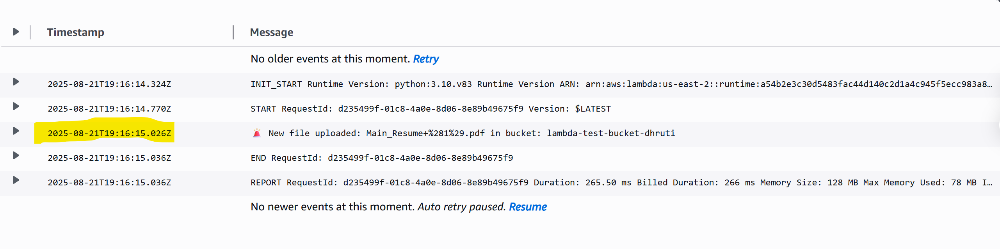

# aws-s3-lambda-alerts
How to build a **serverless security monitoring workflow** using **AWS S3, Lambda, and SNS

# 🚨 AWS S3 → Lambda → SNS Security Alert System

This project demonstrates how to build a **serverless security monitoring workflow** using **AWS S3, Lambda, and SNS**.  
Whenever a file is uploaded to an S3 bucket, a Lambda function is triggered that:  
1. Logs the event to **CloudWatch**  
2. Sends a **real-time email alert** through **SNS**  

---
## 🛠️ Architecture
[ S3 Bucket ] → (event) → [ Lambda Function ] → [ SNS Topic ] → Email Alert
---
## 🚀 How It Works
1. Create an **S3 bucket** (e.g., `lambda-test-bucket-dhruti`)  
2. Create an **SNS topic** (`S3UploadAlerts`) and subscribe your email  
3. Create a **Lambda function** with the code from `lambda_function.py`  
4. Add **S3 as a trigger** for the Lambda (ObjectCreated events)  
5. Give Lambda permissions to **publish to SNS**  
   - Attach `AmazonSNSFullAccess` policy OR  
   - Use an inline policy:
     ```json
     {
       "Effect": "Allow",
       "Action": "sns:Publish",
       "Resource": "arn:aws:sns:us-east-2:<ACCOUNT_ID>:S3UploadAlerts"
     }
     ```
---

## 📧 Example Email Alert


## 📜 Example CloudWatch Log

Bucket: lambda-test-bucket-dhruti
File: test.txt
Size: 1428 bytes
